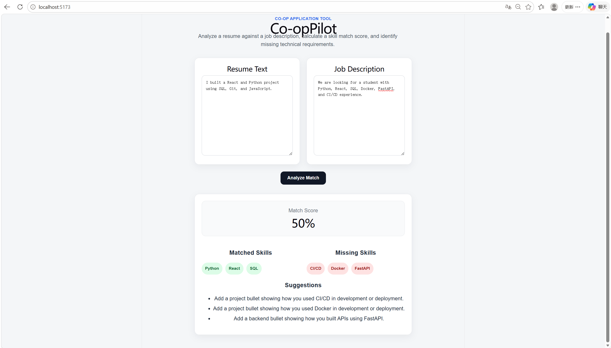
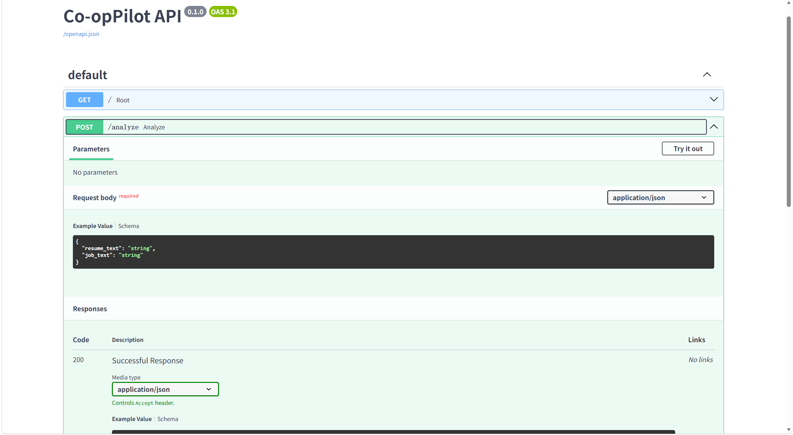
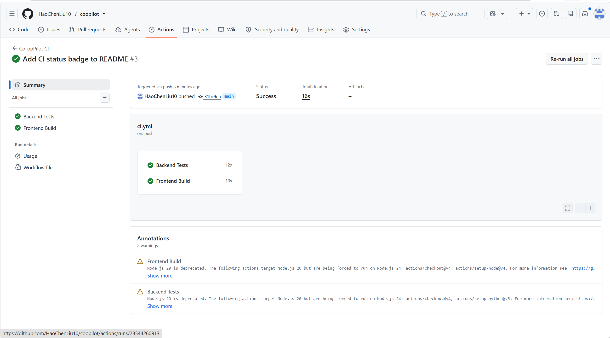

# Co-opPilot

[](https://github.com/HaoChenLiu10/coopilot/actions/workflows/ci.yml)

Co-opPilot is a full-stack web application that helps students analyze how well their resume matches a co-op job description. It extracts technical skills from both the resume and job posting, calculates a match score, identifies missing skills, and provides resume improvement suggestions.

## Features

- Resume and job description analysis
- Technical skill extraction
- Match score calculation
- Matched skill identification
- Missing skill identification
- Resume improvement suggestions
- React + TypeScript frontend
- FastAPI backend
- Pytest unit tests
- GitHub Actions CI pipeline
- Docker Compose support

## Demo



## API Documentation



## Continuous Integration



## Tech Stack

### Frontend

- React
- TypeScript
- Vite
- CSS

### Backend

- Python
- FastAPI
- Pydantic
- Uvicorn

### Testing and DevOps

- Pytest
- GitHub Actions
- Docker
- Docker Compose

## Project Structure

```text
coopilot/
├── backend/
│   ├── app/
│   │   ├── __init__.py
│   │   ├── analyzer.py
│   │   └── main.py
│   ├── tests/
│   │   └── test_analyzer.py
│   ├── Dockerfile
│   ├── .dockerignore
│   ├── pytest.ini
│   └── requirements.txt
│
├── frontend/
│   ├── src/
│   │   ├── App.tsx
│   │   └── App.css
│   ├── Dockerfile
│   ├── .dockerignore
│   ├── package.json
│   └── vite.config.ts
│
├── screenshots/
│   ├── coopilot-demo.png
│   ├── api-docs.png
│   └── ci-pipeline.png
│
├── .github/
│   └── workflows/
│       └── ci.yml
│
├── docker-compose.yml
├── README.md
└── .gitignore
```

## How It Works

1. The user pastes their resume text into the frontend.
2. The user pastes a co-op job description.
3. The frontend sends both texts to the FastAPI backend through a REST API request.
4. The backend extracts technical skills from the resume and job description.
5. The matching algorithm compares resume skills with job requirements.
6. The backend returns a match score, matched skills, missing skills, and suggestions.
7. The React frontend displays the results in a clean dashboard-style interface.

## Example Output

```text
Match Score: 50%

Matched Skills:
Python, React, SQL

Missing Skills:
CI/CD, Docker, FastAPI

Suggestions:
- Add a project bullet showing how you used CI/CD in development or deployment.
- Add a project bullet showing how you used Docker in development or deployment.
- Add a backend bullet showing how you built APIs using FastAPI.
```

## Run Locally

### Backend

```bash
cd backend
python -m venv .venv
.venv\Scripts\activate
pip install -r requirements.txt
python -m uvicorn app.main:app --reload
```

Backend runs at:

```text
http://127.0.0.1:8000
```

API documentation runs at:

```text
http://127.0.0.1:8000/docs
```

### Frontend

Open a second terminal:

```bash
cd frontend
npm install
npm run dev
```

Frontend runs at:

```text
http://localhost:5173
```

## Run with Docker

Make sure Docker Desktop is running, then run this command from the project root:

```bash
docker compose up --build
```

The frontend will be available at:

```text
http://localhost:5173
```

The backend API documentation will be available at:

```text
http://127.0.0.1:8000/docs
```

To stop the containers, press `Ctrl + C`, then run:

```bash
docker compose down
```

## Run Tests

Run backend unit tests:

```bash
cd backend
python -m pytest
```

The project also includes a GitHub Actions CI workflow that automatically runs backend tests and frontend build checks on every push.

## Future Improvements

- Add PDF resume upload
- Add application tracking dashboard
- Add SQLite or PostgreSQL database support
- Add user authentication
- Add saved job applications
- Add interview rate analytics
- Add semantic matching using embeddings or LLM APIs
- Deploy the frontend and backend online